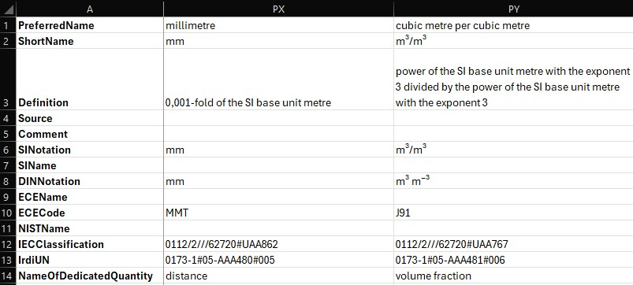
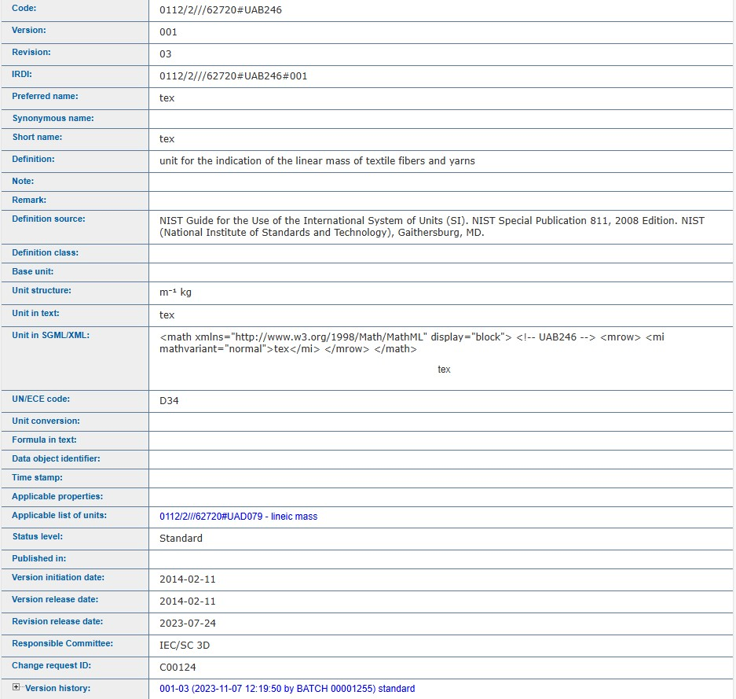
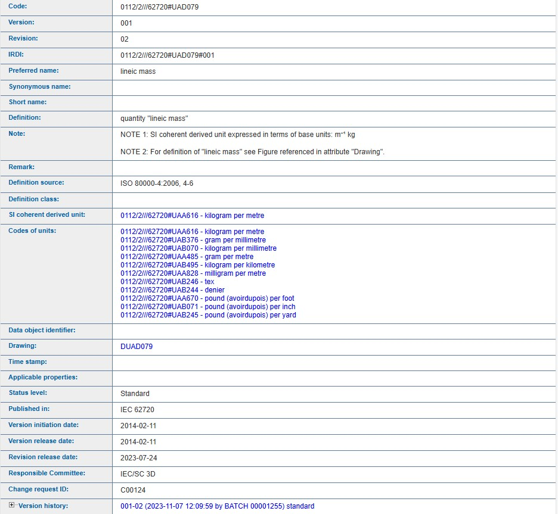
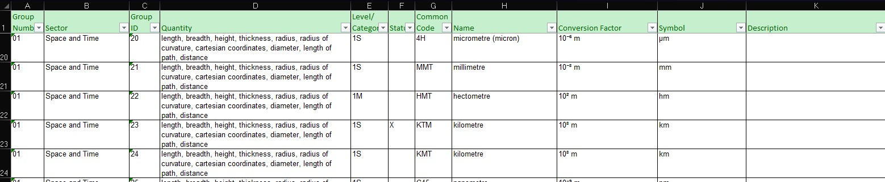
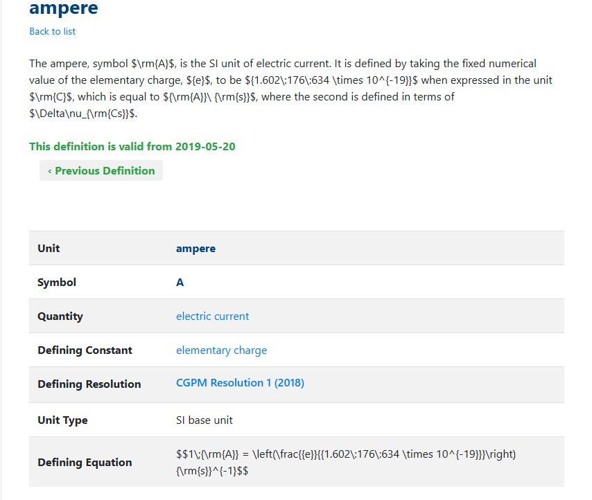
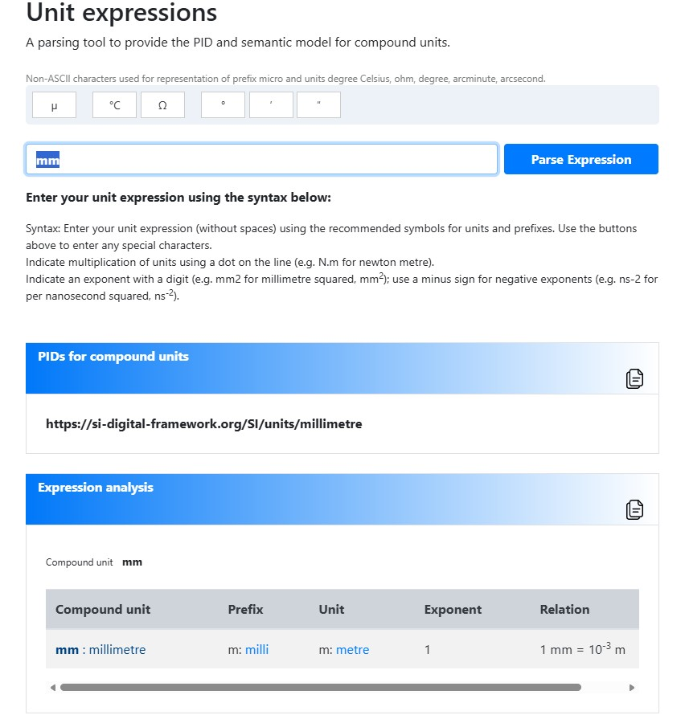

////
Copyright (c) 2026 Industrial Digital Twin Association

This work is licensed under a [Creative Commons Attribution 4.0 International License](
https://creativecommons.org/licenses/by/4.0/). 

SPDX-License-Identifier: CC-BY-4.0

////

[appendix]
= Examplary Mapping of Units of Measurement Based on Different Data Dictionaries 

This section provides a number of examples to illustrate how to model units of measurement using the given data specification template.

== Motivation
The publicly avbailable dictionaries for units of measurements vary greatly in their modelling philosophy and scope. 
They do not only differ in the number of units they contain, but also in the number of descriptive attributes per unit.
Not all dictionaries were created to be "machine interpretable".
Some dictionaries are multi-lingual, some make use of extended UNICODE symbols.
To accomodate the different sources for units the given data specification template for units of measurements is very flexible to use. 
The examples below provide an orientation on how to use that flexibility to map the information from the most prominent public dictionaries to the given data specification template. 

== Examples

The following modelling rules have been applied to the examples and are highly recommended:

* The attributes for an UoM should be consistent, i.e. they should all come from the same source, i.e. dictionary.
It is counterproductive to mix sources, e.g. by providing an UNECE REC 20 ID, but using the definition from ECLASS.
In case of discrepencies between the dictionaries the receiver of the model cannot resolve these conflicts and does not know which source has precedence.
* For the same reason the _classificationSystemVersion_ should be consistent throughout an application. 
The units should not be mixed from different dictionary versions. 
* The source that was actually used and verified for the units should be used as a modelling basis. 
E.g., if the source for the unit definition is a SAMM model then this model should be used consistently to fill the attributes.
Even though the units in SAMM are based on UNECE REC 20, the UNECE dictionary should only be referenced if the modeller used this as the original source.   
It is good scientific practice to only cite the sources that were actually used and not the sources cited by sources.
* Sometimes a UoM is applicable for multiple quantities as denoted by the dictionaries. However, when used for quantifying a properties value, the appropriate quantity has to be selected. 

The tables below are read as follows:

* The first two columns, *attribute* and *card*, provide the respective attribute names and cardinality specified in this data specification template.
* The third column, *mapping recommendation*, provides the information on how to map a unit definition from the given dictionary to the respective AAS atribute. 
** "-----" means that it is recommended to omit this optional attribute.
** [no recommendation] means that an entry has to be provided, but no general mapping rule can be provided.
* For simplicity reasons the examples are only provided in English language even if the respective attribute has a multilanguage datatype.

=== ECLASS

The modelling of UoM in ECLASS Basic and Advanced is similiar, but not identical, even though they are based on the same dataset. 
Some attributes are named differently and some attributes are only available in Basic or Advanced.

Because the version of the property definition is coded into the IRDI/IRI of the property, it is not necessary to supply version information via the attribute _classificationSystemVersion_. 
However, it can be helpful to supply the catalogue version, because it is not possible to directly infer the catalogue version from the property version.

.Mapping recommendation and examples for ECLASS Basic
[width="100%",cols="15%,5%,20%,20%,20%,20%"]
|===
|attribute (of data specification)              | card | mapping recommendation | Example 1 | Example 2 | Example 3
 
 |conceptDescription/id | 1    | _IrdiUN_ of ECLASS unit footnote:eclassIri[Alternatively ID can be provided as IRI starting with \https://api.eclass-cdp.com/ ] |0173-1#05-AAA480#005|\https://api.eclass-cdp.com/0173-1-05-AAA480-003|0173-1#05-AAA793#002

 |preferredName         | 1    | _PreferredName_ of ECLASS unit|millimetre|millimetre|Kilogramm^-1
 |symbol                | 1    | _ShortName_ of ECLASS unit|mm|mm|1/kg
 |specificUnitID        | 0..1 | Optional. Recommended to supply _IRDI_ if _IRI_ is provided as _conceptDescription/id_||0173-1#05-AAA480#003|
 |definition            | 0..1 | _Definition_ of ECLASS unit|0,001-fold of the SI base unit metre|0,001-fold of the SI base unit metre|reciprocal of the SI base unit kilogram

 |preferredNameQuantity | 0..1 | _NameOfDedicatedQuantity_ of ECLASS unit|distance|distance|reciprocal mass
 |quantityID            | 0..1 | -----footnote:[ECLASS basic does not provide the IDs of the quantities in its export] | | |
 |classificationSystem  | 0..1 | "ECLASS" |ECLASS|ECLASS|ECLASS
 |classificationSystemVersion | 0..1 |_ECLASS version_ |15.0|14.0|10.0
 
|===

.Mapping recommendation and examples for ECLASS Advanced
[width="100%",cols="15%,5%,20%,20%,20%,20%"]
|===
|attribute (of data specification)              | card | mapping recommendation | Example 1 | Example 2 | Example 3
 
 |conceptDescription/id | 1    | _id_ of ECLASS unit footnote:eclassIri[] |0173-1#05-AAA480#005|\https://api.eclass-cdp.com/0173-1-05-AAA480-003|0173-1#05-AAA793#002

 |preferredName         | 1    | _preferred_name_ of ECLASS unit|millimetre|millimetre|Kilogramm^-1
 |symbol                | 1    | _short_name_ of ECLASS unit|mm|mm|1/kg
 |specificUnitID        | 0..1 | Optional. Recommended to supply _IRDI_ if _IRI_ is provided as conceptDescription/id||0173-1#05-AAA480#003|
 |definition            | 0..1 | _definition_ of ECLASS unit|0,001-fold of the SI base unit metre|0,001-fold of the SI base unit metre|reciprocal of the SI base unit kilogram

 |preferredNameQuantity | 0..1 | _QuantityReference/name_ of ECLASS unit|distance|distance|reciprocal mass
 |quantityID            | 0..1 | _QuantityReference/url_ of ECLASS unit| 0173-1#Z4-BAJ199#002|\https://api.eclass-cdp.com/0173-1-Z4-BAJ199-002|0173-1#Z4-AAB646#002
 |classificationSystem  | 0..1 | "ECLASS" |ECLASS|ECLASS|ECLASS
 |classificationSystemVersion | 0..1 |_ECLASS version_ |15.0|14.0|10.0
 
|===

.Snapshot of UoM descriptions in ECLASS Basic v16.0 (CSV-Export). Copyright by ECLASS e.V.

.Snapshot of UoM model in ECLASS Advanced v16.0 (XML-Export). Copyright by ECLASS e.V.

=== IEC CDD

IEC CDD and ECLASS can be mapped in a very similiar way.
Because the IEC CDD has no version of the overall catalogue, the atribute _classificationSystemVersion_ should be omitted.

.Mapping recommendation and examples for IEC CDD
[width="100%",cols="15%,5%,20%,20%,20%,20%"]
|===
|attribute (of data specification)              | card | mapping recommendation | Example 1 | Example 2 | Example 3
 
 |conceptDescription/id | 1    | _IRDI_ of IEC CDD unit |0112/2///62720#UAA862#001|\https://cdd.iec.ch/cdd/iec62720/iec62720.nsf/Units/0112-2---62720%23UAB246|0112/2///62720#UAA017#002

 |preferredName         | 1    | _Preferred name_ of IEC CDD unit|millimetre|tex|ohm
 |symbol                | 1    | _Short name_ of IEC CDD unit|mm|tex|Ω
 |specificUnitID        | 0..1 | Optional. Recommended to supply _IRDI_ if _IRI_ is provided as conceptDescription/id||0112/2///62720#UAB246#001|
 |definition            | 0..1 | _Definition_ of IEC CDD unit||unit for the indication of the linear mass of textile fibers and yarns|SI derived unit with special name, for which the following relation applies: 1 Ω = 1 C·A⁻¹ = 1 S⁻¹ = 1 m²·kg¹·s⁻³·A⁻²

 |preferredNameQuantity | 0..1 | _Preferred name_ of the units quantity footnote:iecQuant[The quantities are listed under "Applicable list of units"]|length|lineic mass|electric resistance
 |quantityID            | 0..1 | _IRDI_ of the units quantity footnote:iecQuant[]| 0112/2///62720#UAD072#001|0112/2///62720#UAD079#001|0112/2///62720#UAD045#001
 |classificationSystem  | 0..1 | "IEC CDD" |IEC CDD|IEC CDD|IEC CDD
 |classificationSystemVersion | 0..1 | "-----" |||
 
|===

.View of the IEC CDD entry for the UoM tex. Copyright by the International Electronical Commision (IEC)

.View of the IEC CDD entry for the quantity "lineic mass". Copyright by the International Electronical Commision (IEC)

=== UNECE

In UNECE REC 20 and 21 the UoM are identified by a 2-3 letter code. 
While this code is unique within the specific list, it is not usable as a globally unique identifier. 
Therefore, a different identifier for the Concept Description has to be created. 
The examples illustrate different ways this could be achieved without giving a recommendation.

.Mapping recommendation and examples for UNECE REC 20
[width="100%",cols="15%,5%,20%,20%,20%,20%"]
|===
|attribute (of data specification)              | card | mapping recommendation | Example 1 | Example 2 | Example 3
 
 |conceptDescription/id | 1    | [no recommendation] |uncefact:UNECERec20Code/MMT|uncefact:rec20:kilocandela|\https://service.unece.org/trade/uncefact/vocabulary/rec20#page

 |preferredName         | 1    | _Name_ of UNECE unit|millimetre|kilocandela|page
 |symbol                | 1    | _Representation symbol_ of UNECE unit|mm|kcd|
 |specificUnitID        | 0..1 | _Common code_ of UNECE unit|MMT|P33|ZP
 |definition            | 0..1 | _Description_ of UNECE unit||1000-fold of the SI base unit candela.|A unit of count defining the number of pages.

 |preferredNameQuantity | 0..1 | _Quantity_ of UNECE unit|length|luminous intensity|
 |quantityID            | 0..1 | -----| ||
 |classificationSystem  | 0..1 | "UNECE Rec 20" |UNECE Rec 20|UNECE Rec 20|UNECE Rec 20
 |classificationSystemVersion | 0..1 | _Revision_ of UNECE REC 20 specification |17|16|17
 
|===

.View of exemplary UNECE REC 20 entries (Revision 17, Annex I). Copyright by the United Nations Economic Commission for Europe (UNECE)

.Mapping recommendation and examples for UNECE REC 21
[width="100%",cols="15%,5%,20%,20%,20%,20%"]
|===
|attribute (of data specification)              | card | mapping recommendation | Example 1 | Example 2 | Example 3
 
 |conceptDescription/id | 1    | [no recommendation] |uncefact:UNECERec21Code:8A|uncefact:rec21:piece|\https://service.unece.org/trade/uncefact/vocabulary/rec21/#Parcel

 |preferredName         | 1    | _Name_ of UNECE unit|Pallet, wooden|Piece|Parcel
 |symbol                | 1    | _Name_ of UNECE unit|Pallet, wooden|Piece|Parcel
 |specificUnitID        | 0..1 | _Code_ of UNECE unit|8A|PP|PC
 |definition            | 0..1 | _Description_ of UNECE unit|A platform or open-ended box, made of wood, on which goods are retained for ease of mechanical handling during transport and storage.|A loose or unpacked article.|

 |preferredNameQuantity | 0..1 | -----|||
 |quantityID            | 0..1 | -----|||
 |classificationSystem  | 0..1 | "UNECE Rec 21" |UNECE Rec 21|UNECE Rec 21|UNECE Rec 21
 |classificationSystemVersion | 0..1 | _Revision_ of UNECE REC 21 specification |12|11|12
 
|===

.View of exemplary UNECE REC 21 entries (Revision 12, Annexes V and VI). Copyright by United Nations Economic Commission for Europe
image::example_UNECE2.jpg[align="center"]

=== BIPM (Bureau International des Poids et Mesures) / SI Digital Framework

The BIPM focuses on the maintenance of the SI unit definitions, but also provides a definition of selected non-SI units and constants. In case of compound units the SI digital framework provides a method to generate the PID and semantic definition based on the SI units. However, in these cases a quantity, verbal description and full name are not provided.

.Mapping recommendation and examples for the SI Digital Framework
[width="100%",cols="15%,5%,20%,20%,20%,20%"]
|===
|attribute (of data specification)              | card | mapping recommendation | Example 1 | Example 2 | Example 3
 
 |conceptDescription/id | 1    | _PID_ of BIPM (compound) unit |\https://si-digital-framework.org/SI/units/ampere|\https://si-digital-framework.org/SI/units/dalton|\https://si-digital-framework.org/SI/units/millimetre

 |preferredName         | 1    | _Unit_ or _Compound unit_ of BIPM unit |ampere|dalton|mm
 |symbol                | 1    | _Symbol_ of BIPM unit|A|Da|mm
 |specificUnitID        | 0..1 | -----|||
 |definition            | 0..1 | _Definition_ of BIPM unit||The ampere, symbol A, is the SI unit of electric current. It is defined by taking the fixed numerical value of the elementary charge, e, to be 1.602176634x10^-19 when expressed in the unit C, which is equal to As, where the second is defined in terms of delta_v_cs.|

 |preferredNameQuantity | 0..1 | _Quantity_ of the BIPM unit|electric current|mass|
 |quantityID            | 0..1 | _PID_ of the units quantity|\https://si-digital-framework.org/quantities/ELCU|\https://si-digital-framework.org/quantities/MASS|
 |classificationSystem  | 0..1 | "BIPM" |BIPM|BIPM|BIPM
 |classificationSystemVersion | 0..1 | _valid from_ |2019-05-20||
 
|===

.View of the SI digital framework entry for the UoM Ampere. Copyright by BIPM

.View of the SI digital framework entry for the compound unit millimeter. Copyright by BIPM

=== Other meta models

.Mapping recommendation and examples for OPC UA
[width="100%",cols="15%,5%,20%,20%,20%,20%"]
|===
|attribute (of data specification) | card | mapping recommendation | Example 1 | Example 2 | Example 3
 
 |conceptDescription/id | 1    | [no recommendation] |http://www.opcfoundation.org/UA/units/5131860|http://www.opcfoundation.org/OPC34100/5720146|http://example-company/myCompanionSpec/UAA862

 |preferredName         | 1    | _description_ |millimetre|watt hour|millimetre
 |symbol                | 1    | _displayName | mm|W·h|mm
 |specificUnitID        | 0..1 | _UnitID_|5131860|5720146|UAA862
 |definition            | 0..1 | -----|||

 |preferredNameQuantity | 0..1 | _QuantityType_|length|work|length
 |quantityID            | 0..1 | -----|||
 |classificationSystem  | 0..1 | _namespaceUri_ |http://www.opcfoundation.org/UA/units/un/cefact|http://www.opcfoundation.org/UA/units/un/cefact|http://www.opcfoundation.org/UA/units/ieccdd
 |classificationSystemVersion | 0..1 | ----- |||
 
|===

.Mapping recommendation and examples for SAMM
[width="100%",cols="15%,5%,20%,30%,30%"]
|===
|attribute (of data specification) | card | mapping recommendation | Example 1 | Example 2
 
 |conceptDescription/id | 1    | _Unit element URN_ |urn:samm:org.eclipse.esmf.samm:unit:2.2.0#degreeCelsius|urn:samm:org.eclipse.esmf.samm:unit:2.2.0#percent

 |preferredName         | 1    | _Preferred name_ of unit|degreeCelsius|percent
 |symbol                | 1    | _symbol_ of unit|°C|%
 |specificUnitID        | 0..1 | -----||
 |definition            | 0..1 | _description_||

 |preferredNameQuantity | 0..1 | _quantityKind/preferredName_ of unit |temperature|dimensionless
 |quantityID            | 0..1 | _quantityKind_ of unit | urn:samm:org.eclipse.esmf.samm:unit:2.2.0#temperature|urn:samm:org.eclipse.esmf.samm:unit:2.2.0#dimensionless
 |classificationSystem  | 0..1 | "SAMM" |SAMM|SAMM
 |classificationSystemVersion | 0..1 | Version |2.2|2.2|
 
|===

OPC UA uses the attribute _namespaceUri_ to denote the classification system that has been used as the source for the UoM.
The mapping of the attributes from that classification system is described in OPC UA Specification Part 8, Section 5.6.3.4.

SAMM is based on UNECE Rec 20. The open source model is published as part of the Eclipse Semantic Modeling Framework (ESMF): https://eclipse-esmf.github.io/samm-specification/snapshot/units.html.

When using mete models such as OPC UA or SAMM as the source for UoM, one has to be aware that this introduces "double-mapping".
E.g. UNECE Rec 20 attributes are mapped to an OPC UA nodeset and then the attributes of that nodeset are mapped to the AAS metamodel.
Such "double-mapping" often leads to a degradation of the information and should be avoided, if possible.
However, as stated above, the source that was actually used and veryfied for the units should be used as a modelling basis. 
I.e., if and only if the source for the unit definition is a SAMM model then this model should be used consistently to fill the attributes of the Concept Description template even though SAMM is based on UNECE Rec 20.

=== Examples of not recommended modelling approaches

The following table lists some modelling mistakes that should be avoided.

.Negative examples, i.e. discoraged moddeling approaches
[width="100%",cols="30%,10%,30%,30%"]
|===
|attribute (of data specification)              | card | Example 1 | Example 2
 
 |conceptDescription/id | 1    | 0112/2///62720#UAA023#001| MMT

 |preferredName         | 1    | ångström                 |millimetre
 |symbol                | 0    | Å                        |mm
 |specificUnitID        | 0..1 | A11                      |MMT
 |definition            | 0..1 | 0,000 000 000 1-fold of the SI base unit metre|

 |preferredNameQuantity | 0..1 |                         |   
 |quantityID            | 0..1 |                         |   
 |classificationSystem  | 0..1 | UNECE                   |   
 |classificationSystemVersion | 0..1 |                   |   
 |explanation           |      | Not recommended, because information from multiple sources is mixed| "MMT" is not a unique ID and therefore not suitable as an identifier for conceptDescriptions. The omission of _classificationSystem_ makes it impossible to use the original UNECE catalogue.
 
|===